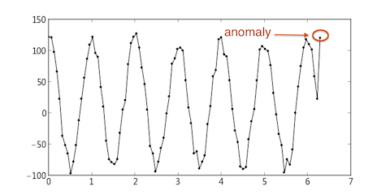

Implementation Introduction
===========================

Anomalies detection
-------------------

[Banshee](https://github.com/eleme/banshee) uses the
[3-sigma](http://en.wikipedia.org/wiki/68%E2%80%9395%E2%80%9399.7_rule)
rule:

> States that nearly all values (99.7%) lie within 3 standard deviations of the mean in a normal distribution.

That means that if a value deviates from the average of the states greater than three times of the standard deviations,
it should be an anomaly.

Describe it in pseudocode:

```go
func IsAnomaly(value float64) bool {
    return math.Abs(value - avg) > 3 * stdDev
}
```

The 3-sigma rule gives us dynamic thresholds which rely on history data.

Let's take a factor, named `score`, used to used to describe the anomalous serverity:

```
score := math.Abs(value - avg) / (3 * stdDev)
```

If a input value gives `score > 1`, it should be an anomaly, and the `score` larger, the more serious anomalous.

Periodicity
-----------

Reality metrics are always with periodicity.



For an example, the marked point on the picture above should be an anomaly,
it should be much smaller at this time.

Banshee only picks datapoints with same "phase" as detection data source.

Trending
--------

Banshee dosen't use the `score` directly for alerts, but use the `trend`. The `trend` is described
via [weighted moving average](http://en.wikipedia.org/wiki/Moving_average):

```
trend[0] = score[0]
trend[i + 1] = trend[i] * (1 - factor) + factor * score[i]
```

In the recursive formula above, `trend` is the trending sequence, `score` is the anomalous
serverity sequence, `factor` is a real number between 0 and 1.

If we expand the this formula, we would find that it dilutes old data's contribution,
later data contributes more to the result, and the `factor` larger, the timeliness better.
In a word, the result `trend` follows the trending of sequence `score`.

* If the `trend > 0`, that means the metric is trending up, furthermore, if `trend > 1`, that means the metric 
   is trending up anomalously.
* If the `trend < 0`, that means the metric is trending down, furthermore, if `trend < -1`, that means the metric
   is trending down anomalously.

By using the `trend` instead of the original `score`, banshee mutes the burr alerts, "soft" anomalies within a
very short time will be ignored.

Filter
------

Banshee filters incoming metrics by alert rule, a rule has a wildcard like pattern.

If we use the traditional wildcard patterns to filter metrics, we have to traverse all rules each time,
that is very slow. So we build a [suffix tree](https://en.wikipedia.org/wiki/Suffix_tree) to do the job,
and the practice shows it's very very fast.
